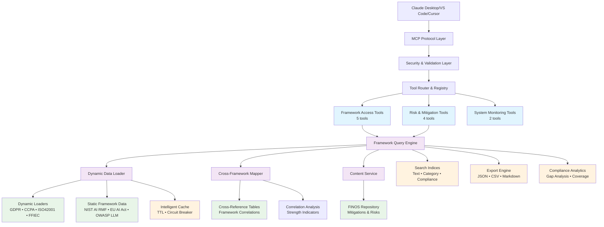
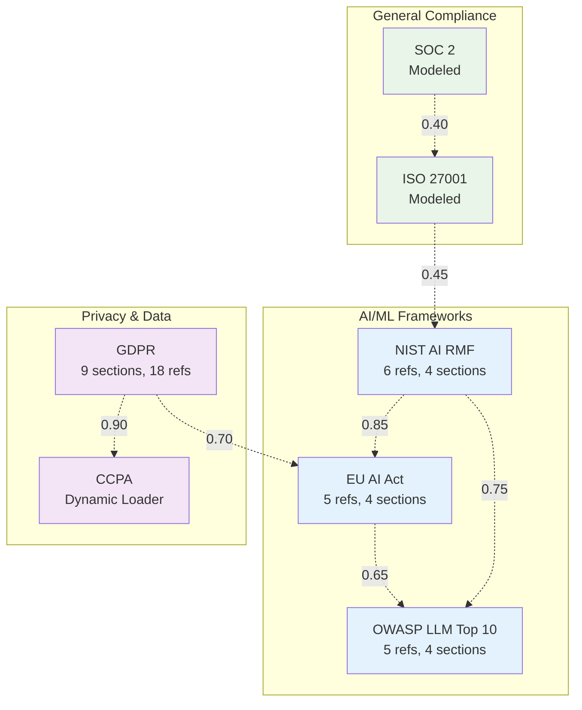
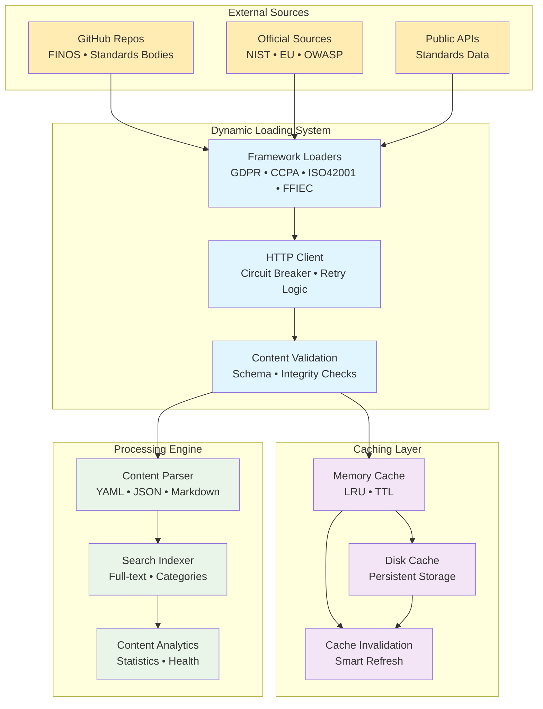

# Framework System Architecture

Comprehensive documentation of the governance framework system architecture, design patterns, and integration capabilities.

## System Overview

The FINOS MCP Server implements a multi-layer architecture designed for scalability, security, and extensibility in governance framework operations.



## Core Components

### 1. Framework Data Loader (`FrameworkDataLoader`)

**Purpose**: Dynamic loading and management of governance framework data.

**Key Features**:
- Dynamic content fetching from official sources
- Intelligent caching with TTL management
- Circuit breaker protection for external dependencies
- Support for both static and dynamic frameworks

**Supported Framework Types**:
- **Active Frameworks**: Live data from official sources (NIST, EU, OWASP, GDPR)
- **Modeled Frameworks**: Internal representations (CCPA, ISO 27001, SOC 2)

**Implementation Pattern**:
```python
class FrameworkDataLoader:
    async def load_all_frameworks(self) -> List[Framework]
    async def load_framework(self, framework_id: str) -> Framework
    async def refresh_framework(self, framework_id: str) -> bool
```

### 2. Framework Query Engine (`FrameworkQueryEngine`)

**Purpose**: Unified query interface across all governance frameworks.

**Capabilities**:
- Multi-framework search with relevance scoring
- Semantic similarity matching
- Advanced filtering (severity, compliance status, categories)
- Result ranking and pagination

**Query Processing Pipeline**:


**Performance Optimizations**:
- In-memory indexing for fast searches
- Query result caching
- Lazy loading of framework content
- Parallel framework searches

### 3. Cross-Framework Mapper (`CrossFrameworkMapper`)

**Purpose**: Intelligent mapping between different governance frameworks.

**Framework Relationship Matrix**:


**Mapping Types & Strength Levels**:
- **Equivalent** (0.8-1.0): Direct 1:1 control mapping
- **Related** (0.5-0.8): Thematically similar controls
- **Complementary** (0.2-0.5): Controls that work together

### 4. Content Service Integration

**Purpose**: Unified interface for accessing diverse content sources.

**Data Flow Architecture**:


**Service Architecture Code Pattern**:
```python
class ContentService:
    async def get_document(self, type: str, filename: str) -> Dict
    async def search_documents(self, query: str) -> List[Dict]
    async def get_framework_data(self, framework_id: str) -> Dict
```

**Content Sources**:
- Local file system (legacy FINOS content)
- Remote APIs (official framework sources)
- Cached content store
- Dynamic loader services

## Data Models

### Framework Model

```python
@dataclass
class Framework:
    id: str
    name: str
    description: str
    type: FrameworkType  # ACTIVE, MODELED
    version: str
    last_updated: datetime
    references: List[FrameworkReference]
    categories: List[str]
    compliance_metrics: ComplianceMetrics
```

### Framework Reference

```python
@dataclass
class FrameworkReference:
    id: str
    title: str
    content: str
    category: str
    severity: SeverityLevel
    compliance_status: ComplianceStatus
    tags: List[str]
    related_controls: List[str]
```

### Search Result

```python
@dataclass
class FrameworkSearchResult:
    framework: str
    reference_id: str
    title: str
    content: str
    relevance_score: float
    severity: SeverityLevel
    compliance_status: ComplianceStatus
    highlights: List[str]
```

## Integration Patterns

### 1. Tool Integration Pattern

All framework tools follow a consistent pattern:

```python
async def handle_framework_tool(name: str, arguments: dict) -> List[TextContent]:
    # 1. Initialize framework components
    await _ensure_framework_components()

    # 2. Validate input arguments
    validated_args = validate_arguments(arguments)

    # 3. Execute framework operation
    result = await _framework_operation(validated_args)

    # 4. Format and return response
    return format_response(result)
```

### 2. Caching Strategy

**Multi-Level Caching**:
- **L1**: In-memory framework data cache
- **L2**: Query result cache with TTL
- **L3**: Persistent disk cache for expensive operations

**Cache Invalidation**:
- Time-based expiration (TTL)
- Content-based invalidation
- Manual cache refresh capabilities

### 3. Error Handling Pattern

**Graceful Degradation**:
```python
try:
    # Primary operation
    result = await primary_framework_operation()
except FrameworkUnavailableError:
    # Fallback to cached data
    result = await get_cached_framework_data()
except Exception as e:
    # Return structured error response
    return create_error_response(e)
```

## Security Architecture

### 1. Input Validation

**Multi-Layer Validation**:
- Schema validation using Pydantic models
- SQL injection prevention
- Path traversal protection
- Content size limits

### 2. Rate Limiting

**Sliding Window Algorithm**:
- Per-client rate limiting
- Different limits for different tool categories
- Circuit breaker for overloaded services

### 3. Content Security

**Safe Content Handling**:
- Content sanitization for external sources
- File type validation
- Size limits enforcement
- Dangerous pattern detection

## Performance Characteristics

### Response Time Targets

| Operation Type | Target Time | Cache Hit | Cache Miss |
|----------------|-------------|-----------|------------|
| Framework List | <50ms | <10ms | <100ms |
| Simple Search | <200ms | <50ms | <500ms |
| Complex Query | <1s | <200ms | <2s |
| Export Operation | <5s | <1s | <10s |

### Scalability Metrics

- **Concurrent Users**: 100+ simultaneous connections
- **Request Throughput**: 1000+ requests/minute
- **Memory Usage**: <500MB base, <2GB peak
- **Framework Count**: Supports 10+ frameworks simultaneously

### Caching Performance

- **Cache Hit Rate**: >95% for framework data
- **Query Cache**: >80% hit rate for common searches
- **Memory Efficiency**: LRU eviction with size limits

## Extension Points

### 1. Adding New Frameworks

**Implementation Steps**:
1. Create framework data model
2. Implement data loader for framework
3. Add framework to supported list
4. Update cross-framework mappings
5. Add framework-specific tests

**Framework Loader Interface**:
```python
class CustomFrameworkLoader:
    async def load_framework_data(self) -> Framework
    async def refresh_data(self) -> bool
    def get_framework_metadata(self) -> FrameworkMetadata
```

### 2. Custom Tool Development

**Tool Development Pattern**:
```python
# 1. Define tool schema
CUSTOM_TOOL = Tool(
    name="custom_operation",
    description="Custom framework operation",
    inputSchema=custom_schema
)

# 2. Implement handler
async def handle_custom_tool(arguments: dict) -> List[TextContent]:
    # Tool implementation
    pass

# 3. Register with system
FRAMEWORK_TOOLS.append(CUSTOM_TOOL)
TOOL_HANDLERS["custom_operation"] = handle_custom_tool
```

### 3. Content Source Integration

**Adding New Content Sources**:
```python
class CustomContentProvider:
    async def fetch_content(self, identifier: str) -> Dict
    async def search_content(self, query: str) -> List[Dict]
    def get_content_metadata(self) -> ContentMetadata
```

## Monitoring and Observability

### 1. Health Monitoring

**Service Health Checks**:
- Framework loader health
- Content service availability
- Cache performance metrics
- External API connectivity

### 2. Performance Metrics

**Key Performance Indicators**:
- Response time percentiles (P50, P95, P99)
- Error rates by tool type
- Cache hit rates
- Framework load times

### 3. Logging and Tracing

**Structured Logging**:
- Request/response logging
- Performance metrics
- Error tracking
- Security event logging

**Correlation IDs**:
- Request tracing across components
- Cross-framework operation tracking
- Error correlation and debugging

## Configuration Management

### 1. Framework Configuration

```yaml
frameworks:
  nist_ai_rmf:
    enabled: true
    source: "official_api"
    cache_ttl: 3600
    refresh_interval: 86400

  custom_framework:
    enabled: true
    source: "file_system"
    path: "/data/custom"
```

### 2. Performance Tuning

```yaml
performance:
  cache:
    max_memory: "256MB"
    ttl_default: 3600

  rate_limiting:
    tool_calls: 50
    resource_access: 200

  timeouts:
    framework_load: 30
    search_operation: 10
```

### 3. Security Settings

```yaml
security:
  validation:
    max_query_length: 1000
    max_result_size: "50MB"

  rate_limiting:
    enabled: true
    window_seconds: 60
```

This architecture provides a robust, scalable foundation for governance framework operations while maintaining security, performance, and extensibility requirements.
