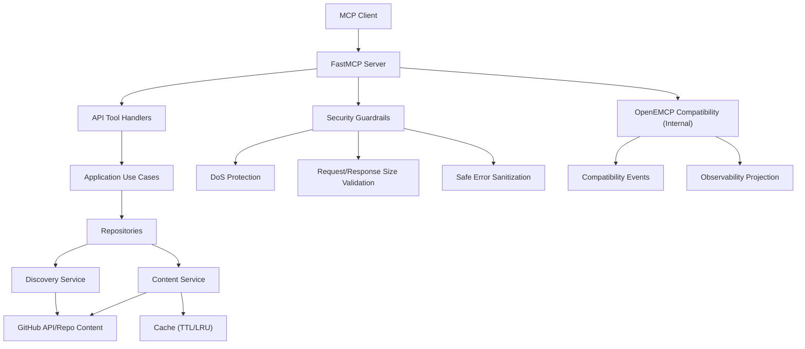

# Framework System Architecture

Runtime-accurate architecture for the FINOS AI Governance MCP Server.

## Runtime Overview

The server is a FastMCP application exposing:

- 11 MCP tools
- 3 MCP resources (`finos://frameworks/{id}`, `finos://risks/{id}`, `finos://mitigations/{id}`)
- 3 MCP prompts

Core runtime module:
- `src/finos_mcp/fastmcp_server.py`

## Layered Design (Runtime Truth)

```mermaid
graph TD
    A["MCP Client"] --> B["FastMCP Server"]
    B --> C["API Tool Handlers"]
    C --> D["Application Use Cases"]
    D --> E["Repositories"]
    E --> F["Discovery Service"]
    E --> G["Content Service"]
    G --> H["Cache (TTL/LRU)"]
    F --> I["GitHub API/Repo Content"]
    G --> I

    B --> J["Security Guardrails"]
    J --> K["DoS Protection"]
    J --> L["Request/Response Size Validation"]
    J --> M["Safe Error Sanitization"]

    B --> N["OpenEMCP Compatibility (Internal)"]
    N --> O["Compatibility Events"]
    N --> P["Observability Projection"]
```

## Components

### 1. FastMCP Server Surface

Defined in `src/finos_mcp/fastmcp_server.py`:

- tool declarations (`@mcp.tool`)
- resource declarations (`@mcp.resource`)
- prompt declarations (`@mcp.prompt`)
- structured output models (`FrameworkList`, `DocumentList`, `ServiceHealth`, `CacheStats`)

### 2. API Handlers

Thin payload builders in:
- `src/finos_mcp/api/tools/governance_tool_handlers.py`

Responsibilities:
- invoke DoS checks
- validate request parameters
- delegate to application use-cases
- return normalized payload dictionaries

### 3. Application Use-Cases

Business logic in:
- `src/finos_mcp/application/use_cases/framework_use_cases.py`
- `src/finos_mcp/application/use_cases/risk_mitigation_use_cases.py`

Key behavior:
- runtime discovery-first catalogs
- explicit degraded state signaling (`source: "unavailable"`, `message`)
- deterministic shaping of list/get/search outputs

### 4. Repositories + Content/Discovery

Repository adapters:
- `src/finos_mcp/infrastructure/repositories/framework_repository.py`
- `src/finos_mcp/infrastructure/repositories/risk_mitigation_repository.py`

Data services:
- discovery: `src/finos_mcp/content/discovery.py`
- content fetch/service: `src/finos_mcp/content/service.py`
- cache: `src/finos_mcp/content/cache.py`

Runtime behavior:
- live discovery against configured GitHub repository paths
- cached discovery reuse where available
- explicit unavailable responses when discovery cannot complete

### 5. Security And Guardrails

Security modules:
- `src/finos_mcp/security/request_validator.py`
- `src/finos_mcp/security/error_handler.py`

Guardrails in runtime:
- DoS/rate limiting and concurrency protection
- request parameter size checks
- resource/document payload size checks
- sanitized external error messages

### 6. Internal OpenEMCP Compatibility Layer

Compatibility primitives and projections:
- `src/finos_mcp/openemcp/*`
- `src/finos_mcp/compat/*`
- `src/finos_mcp/application/services/compat_event_service.py`
- `src/finos_mcp/application/services/observability_projection_service.py`

Current runtime use:
- additive `observability` fields on:
  - `get_service_health`
  - `get_cache_stats`
- canonical status normalization (`approved`, `rejected`, `modified`)
- internal envelope event buffering for compatibility telemetry

## Tool Category Mapping

- Framework Access (5): `list_frameworks`, `get_framework`, `search_frameworks`, `list_risks`, `get_risk`
- Risk & Mitigation (4): `search_risks`, `list_mitigations`, `get_mitigation`, `search_mitigations`
- System Monitoring (2): `get_service_health`, `get_cache_stats`

## Degraded-Mode Contract

Runtime contract when upstream discovery is unavailable:

- list/search tools: return structured empty results + message
- get tools: return safe unavailable content
- no static filename fallback catalogs are used in runtime responses

## Configuration-Driven Behavior

Key runtime controls from `src/finos_mcp/config.py`:

- transport/binding (`FINOS_MCP_MCP_TRANSPORT`, host, port)
- boundary auth (`FINOS_MCP_MCP_AUTH_*`)
- discovery repo/path settings (`FINOS_MCP_GITHUB_*`)
- cache controls (`FINOS_MCP_CACHE_*`)
- DoS controls (`FINOS_MCP_DOS_*`)

## Scope Clarification

This document intentionally describes the implemented runtime architecture only.
It does not describe hypothetical future components, alternate engines, or
non-runtime conceptual designs.
