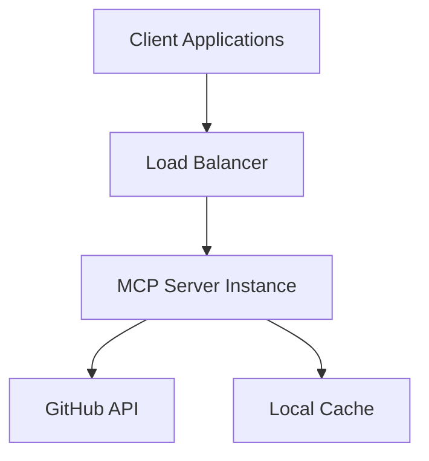
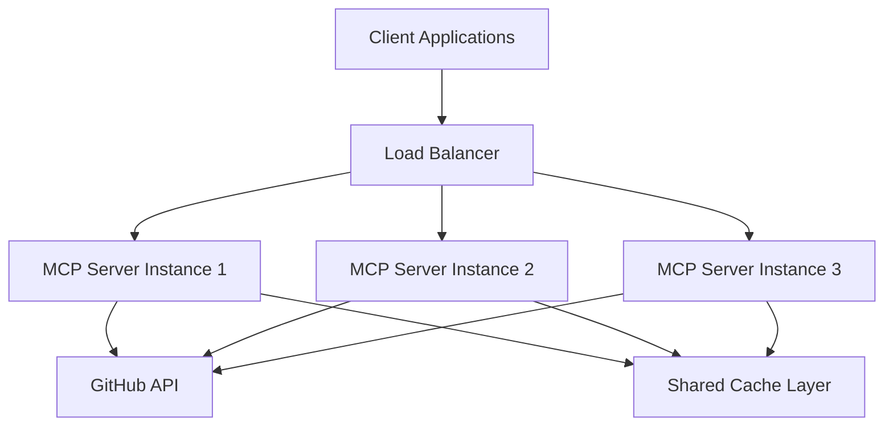

# 🚀 Independent AI Governance MCP Server - Production Deployment Guide

Comprehensive guide for deploying this independent AI Governance MCP Server project in production environments.

## 📋 Table of Contents

- [Production Requirements](#production-requirements)
- [Deployment Architectures](#deployment-architectures)
- [Configuration Management](#configuration-management)
- [Security Hardening](#security-hardening)
- [Performance Optimization](#performance-optimization)
- [Monitoring & Observability](#monitoring--observability)
- [Backup & Disaster Recovery](#backup--disaster-recovery)
- [Troubleshooting](#troubleshooting)

## 🎯 Production Requirements

### System Requirements

#### Minimum Production Specifications
- **CPU**: 1 vCPU (2+ recommended)
- **Memory**: 512MB RAM (1GB+ recommended)
- **Storage**: 1GB disk space
- **Network**: 100Mbps internet connection
- **OS**: Linux (Ubuntu 20.04+, CentOS 8+, RHEL 8+)

#### Recommended Production Specifications
- **CPU**: 2+ vCPUs for high availability
- **Memory**: 2GB+ RAM with swap configured
- **Storage**: 5GB+ SSD storage
- **Network**: 1Gbps connection with redundancy
- **OS**: Latest LTS Linux distribution

### Software Dependencies
- **Python**: 3.11+ (latest stable recommended)
- **Process Manager**: systemd, supervisor, or Docker
- **Reverse Proxy**: nginx or Apache (optional)
- **Monitoring**: Prometheus, Grafana, or equivalent

### Infrastructure Requirements
- **High Availability**: Multi-instance deployment
- **Load Balancing**: For multiple instances
- **SSL/TLS**: Certificate management
- **Firewall**: Network security controls
- **Backup**: Regular configuration and data backups

## 🏗️ Deployment Architectures

### Single Instance Deployment



**Use Cases:**
- Development/staging environments
- Small-scale production deployments
- Cost-optimized setups

### High Availability Deployment



**Use Cases:**
- Production environments
- High-traffic applications
- Mission-critical deployments

### Container Orchestration

**Note:** Docker images are not currently available for this independent project. Use the Python installation methods described below.

## ⚙️ Configuration Management

### Environment-Based Configuration

**Production Environment Variables:**
```bash
# Core Configuration
FINOS_MCP_LOG_LEVEL=WARNING
FINOS_MCP_DEBUG_MODE=false
FINOS_MCP_SERVER_NAME=finos-ai-governance-prod

# Performance Configuration
FINOS_MCP_HTTP_TIMEOUT=60
FINOS_MCP_ENABLE_CACHE=true
FINOS_MCP_CACHE_MAX_SIZE=10000
FINOS_MCP_CACHE_TTL_SECONDS=7200

# GitHub API Configuration
FINOS_MCP_GITHUB_TOKEN=${GITHUB_TOKEN_PROD}
FINOS_MCP_GITHUB_API_DELAY_SECONDS=0.5
FINOS_MCP_GITHUB_API_MAX_RETRIES=5

# Security Configuration
FINOS_MCP_GITHUB_API_RATE_LIMIT_BUFFER=20
```

### Configuration File Management

**Create production configuration file:**
```bash
# /opt/finos-mcp/config/production.env
FINOS_MCP_LOG_LEVEL=INFO
FINOS_MCP_HTTP_TIMEOUT=45
FINOS_MCP_ENABLE_CACHE=true
FINOS_MCP_CACHE_MAX_SIZE=5000
FINOS_MCP_GITHUB_TOKEN_FILE=/opt/finos-mcp/secrets/github-token
```

**Secure file permissions:**
```bash
sudo chown root:finos-mcp /opt/finos-mcp/config/production.env
sudo chmod 640 /opt/finos-mcp/config/production.env
```

### Configuration Validation

**Pre-deployment validation script:**
```bash
#!/bin/bash
# validate-config.sh

echo "Validating production configuration..."

# Test configuration loading
python -c "from finos_mcp.config import Settings; Settings(); print('Config validation: PASSED')"

# Test basic import
python -c "import finos_mcp; print('Import test: PASSED')"

# Test content service
python -c "
import asyncio
from finos_mcp.content.service import get_content_service

async def test():
    service = await get_content_service()
    print('Content service: READY')
    
asyncio.run(test())
print('Service connectivity: PASSED')
"

echo "Configuration validation complete!"
```

## 🔒 Security Hardening

### Application Security

**1. GitHub Token Security**
```bash
# Store token in secure file
echo "ghp_your_production_token" | sudo tee /opt/finos-mcp/secrets/github-token
sudo chmod 600 /opt/finos-mcp/secrets/github-token
sudo chown finos-mcp:finos-mcp /opt/finos-mcp/secrets/github-token

# Reference in environment
export FINOS_MCP_GITHUB_TOKEN_FILE=/opt/finos-mcp/secrets/github-token
```

**2. System User Configuration**
```bash
# Create dedicated system user
sudo useradd --system --shell /bin/false --home-dir /opt/finos-mcp finos-mcp

# Set proper ownership
sudo chown -R finos-mcp:finos-mcp /opt/finos-mcp
```

**3. File System Security**
```bash
# Secure configuration directory
sudo chmod 750 /opt/finos-mcp/config
sudo chmod 700 /opt/finos-mcp/secrets
sudo chmod 640 /opt/finos-mcp/config/*.env
sudo chmod 600 /opt/finos-mcp/secrets/*
```

### Network Security

**Firewall Configuration (UFW):**
```bash
# Allow only necessary ports
sudo ufw default deny incoming
sudo ufw default allow outgoing
sudo ufw allow 22/tcp    # SSH
sudo ufw allow 80/tcp    # HTTP (for health checks)
sudo ufw allow 443/tcp   # HTTPS
sudo ufw enable
```

**Nginx Reverse Proxy (Optional):**
```nginx
# /etc/nginx/sites-available/finos-mcp
server {
    listen 80;
    server_name finos-mcp.yourdomain.com;

    location /health {
        proxy_pass http://127.0.0.1:8080/health;
        proxy_set_header Host $host;
        proxy_set_header X-Real-IP $remote_addr;
    }

    # Block all other traffic
    location / {
        return 444;  # Close connection without response
    }
}
```

### SSL/TLS Configuration

**Let's Encrypt Certificate:**
```bash
# Install certbot
sudo apt update && sudo apt install certbot python3-certbot-nginx

# Obtain certificate
sudo certbot --nginx -d finos-mcp.yourdomain.com

# Auto-renewal
sudo systemctl enable certbot.timer
```

## 🚀 Performance Optimization

### Resource Allocation

**Memory Optimization:**
```bash
# Configure swap for memory bursts
sudo fallocate -l 2G /swapfile
sudo chmod 600 /swapfile
sudo mkswap /swapfile
sudo swapon /swapfile

# Add to /etc/fstab for persistence
echo '/swapfile none swap sw 0 0' | sudo tee -a /etc/fstab
```

**CPU Optimization:**
```bash
# Production environment settings
export FINOS_MCP_CACHE_MAX_SIZE=10000          # Larger cache
export FINOS_MCP_GITHUB_API_DELAY_SECONDS=0.3  # Faster API calls
export FINOS_MCP_HTTP_TIMEOUT=45               # Balanced timeout
```

### Caching Strategy

**High-Performance Cache Configuration:**
```bash
# Large cache with longer TTL for production
export FINOS_MCP_CACHE_MAX_SIZE=20000
export FINOS_MCP_CACHE_TTL_SECONDS=14400  # 4 hours
export FINOS_MCP_ENABLE_CACHE=true
```

**Cache Warming Script:**
```bash
#!/bin/bash
# warm-cache.sh - Pre-populate cache with common queries

python -c "
import asyncio
from finos_mcp.content.service import get_content_service

async def warm_cache():
    try:
        service = await get_content_service()
        
        # Common queries to pre-populate cache
        mitigation_queries = ['data privacy', 'security', 'governance', 'compliance']
        risk_queries = ['prompt injection', 'data poisoning', 'adversarial', 'bias']
        
        print('Warming mitigation cache...')
        for query in mitigation_queries:
            result = await service.search_mitigations(query)
            print(f'  - {query}: {len(result)} results cached')
            
        print('Warming risk cache...')
        for query in risk_queries:
            result = await service.search_risks(query)
            print(f'  - {query}: {len(result)} results cached')
            
        # Pre-load popular documents
        popular_mitigations = ['mi-1', 'mi-2', 'mi-3', 'mi-7']
        popular_risks = ['ri-10', 'ri-3', 'ri-12', 'ri-15']
        
        print('Pre-loading popular mitigations...')
        for mitigation_id in popular_mitigations:
            await service.get_mitigation_details(mitigation_id)
            print(f'  - {mitigation_id} cached')
            
        print('Pre-loading popular risks...')
        for risk_id in popular_risks:
            await service.get_risk_details(risk_id)
            print(f'  - {risk_id} cached')
            
        print('Cache warming completed successfully!')
        
    except Exception as e:
        print(f'Cache warming failed: {e}')

asyncio.run(warm_cache())
"
```

## 📊 Monitoring & Observability

### Health Monitoring

**Health Check Script:**
```python
#!/usr/bin/env python
# health-check.py
import asyncio
import sys

async def check_health():
    try:
        from finos_mcp.tools.system import handle_system_tools
        
        # Check service health
        result = await handle_system_tools('get_service_health', {})
        print("Health check: PASSED")
        print(result[0].text)
        return 0
    except Exception as e:
        print(f"Health check: ERROR ({e})")
        return 1

if __name__ == '__main__':
    sys.exit(asyncio.run(check_health()))
```

**Systemd Health Monitoring:**
```ini
# /etc/systemd/system/finos-mcp.service
[Unit]
Description=FINOS AI Governance MCP Server
After=network.target

[Service]
Type=simple
User=finos-mcp
Group=finos-mcp
WorkingDirectory=/opt/finos-mcp
EnvironmentFile=/opt/finos-mcp/config/production.env
ExecStart=/opt/finos-mcp/venv/bin/finos-mcp
ExecReload=/bin/kill -HUP $MAINPID
Restart=always
RestartSec=5

# Health monitoring
ExecStartPost=/opt/finos-mcp/scripts/health-check.sh
WatchdogSec=60

[Install]
WantedBy=multi-user.target
```

### Metrics Collection

**Basic Metrics Script:**
```python
#!/usr/bin/env python
# metrics-collector.py

import json
import psutil
import time
from pathlib import Path

def collect_metrics():
    metrics = {
        'timestamp': int(time.time()),
        'system': {
            'cpu_percent': psutil.cpu_percent(),
            'memory_percent': psutil.virtual_memory().percent,
            'disk_percent': psutil.disk_usage('/').percent
        },
        'application': {
            'uptime_seconds': get_uptime(),
            'cache_size': get_cache_size(),
            'request_count': get_request_count()
        }
    }

    # Write metrics to file for collection
    metrics_file = Path('/tmp/finos-mcp-metrics.json')
    with open(metrics_file, 'w') as f:
        json.dump(metrics, f, indent=2)

if __name__ == '__main__':
    collect_metrics()
```

**Prometheus Integration:**
```python
# prometheus-exporter.py
from prometheus_client import start_http_server, Gauge, Counter
import time
import psutil

# Define metrics
cpu_usage = Gauge('finos_mcp_cpu_percent', 'CPU usage percentage')
memory_usage = Gauge('finos_mcp_memory_percent', 'Memory usage percentage')
request_count = Counter('finos_mcp_requests_total', 'Total requests processed')

def collect_and_expose_metrics():
    # Start Prometheus metrics server
    start_http_server(8000)

    while True:
        cpu_usage.set(psutil.cpu_percent())
        memory_usage.set(psutil.virtual_memory().percent)
        time.sleep(30)

if __name__ == '__main__':
    collect_and_expose_metrics()
```

### Log Management

**Structured Logging Configuration:**
```bash
# Production logging setup
export FINOS_MCP_LOG_LEVEL=INFO
export FINOS_MCP_DEBUG_MODE=false

# Log to file with rotation
export FINOS_MCP_LOG_FILE=/var/log/finos-mcp/application.log
```

**Logrotate Configuration:**
```bash
# /etc/logrotate.d/finos-mcp
/var/log/finos-mcp/*.log {
    daily
    rotate 30
    compress
    delaycompress
    missingok
    notifempty
    copytruncate
    postrotate
        /bin/systemctl reload finos-mcp
    endscript
}
```

## 💾 Backup & Disaster Recovery

### Configuration Backup

**Backup Script:**
```bash
#!/bin/bash
# backup-config.sh

BACKUP_DIR="/opt/backups/finos-mcp"
DATE=$(date +%Y%m%d_%H%M%S)

# Create backup directory
mkdir -p "$BACKUP_DIR/$DATE"

# Backup configuration files
cp -r /opt/finos-mcp/config "$BACKUP_DIR/$DATE/" 2>/dev/null || true
cp /etc/systemd/system/finos-mcp.service "$BACKUP_DIR/$DATE/" 2>/dev/null || true

# Backup secrets (encrypted) - only if directory exists
if [ -d "/opt/finos-mcp/secrets" ]; then
    tar -czf "$BACKUP_DIR/$DATE/secrets.tar.gz" -C /opt/finos-mcp secrets/
    gpg --cipher-algo AES256 --compress-algo 1 --s2k-mode 3 \
        --s2k-digest-algo SHA512 --s2k-count 65536 --symmetric \
        --output "$BACKUP_DIR/$DATE/secrets.gpg" "$BACKUP_DIR/$DATE/secrets.tar.gz"
    rm "$BACKUP_DIR/$DATE/secrets.tar.gz"
fi

# Backup application state
python -c "
from finos_mcp.tools.system import handle_system_tools
import asyncio
import json

async def backup_metrics():
    try:
        health = await handle_system_tools('get_service_health', {})
        metrics = await handle_system_tools('get_service_metrics', {})
        cache_stats = await handle_system_tools('get_cache_stats', {})
        
        backup_data = {
            'timestamp': '$(date -Iseconds)',
            'health': health[0].text if health else 'N/A',
            'metrics': metrics[0].text if metrics else 'N/A',
            'cache': cache_stats[0].text if cache_stats else 'N/A'
        }
        
        with open('$BACKUP_DIR/$DATE/app_state.json', 'w') as f:
            json.dump(backup_data, f, indent=2)
        print('Application state backed up')
    except Exception as e:
        print(f'Application state backup failed: {e}')

asyncio.run(backup_metrics())
" 2>/dev/null || echo "Application state backup skipped"

# Cleanup old backups (keep 30 days)
find "$BACKUP_DIR" -type d -mtime +30 -exec rm -rf {} \; 2>/dev/null || true

echo "Backup completed: $BACKUP_DIR/$DATE"
```

**Automated Backup Schedule:**
```bash
# Add to crontab
crontab -e

# Daily backup at 2 AM
0 2 * * * /opt/finos-mcp/scripts/backup-config.sh
```

### Disaster Recovery Plan

**1. Server Replacement Procedure:**
```bash
# Quick deployment script for new server
#!/bin/bash
# restore-deployment.sh

# Install system dependencies
sudo apt update && sudo apt install python3 python3-venv git

# Create application user
sudo useradd --system --shell /bin/false --home-dir /opt/finos-mcp finos-mcp

# Create directories
sudo mkdir -p /opt/finos-mcp/{config,secrets,logs,scripts}

# Restore from backup
# (Assumes backup is available and decrypted)
sudo cp -r /backup/finos-mcp/config/* /opt/finos-mcp/config/
sudo cp -r /backup/finos-mcp/secrets/* /opt/finos-mcp/secrets/

# Install application
cd /opt/finos-mcp
sudo -u finos-mcp python3 -m venv venv
sudo -u finos-mcp ./venv/bin/pip install git+https://github.com/hugo-calderon/finos-mcp-server.git

# Restore systemd service
sudo cp /backup/finos-mcp/finos-mcp.service /etc/systemd/system/
sudo systemctl daemon-reload
sudo systemctl enable finos-mcp
sudo systemctl start finos-mcp

echo "Disaster recovery complete!"
```

**2. Recovery Testing:**
```bash
# Monthly recovery test script
#!/bin/bash
# test-recovery.sh

# Create test environment
TEST_DIR="/tmp/recovery-test-$(date +%s)"
mkdir -p "$TEST_DIR"

echo "Testing recovery in: $TEST_DIR"

# Copy restore script to test directory
cp /backup/finos-mcp/restore-deployment.sh "$TEST_DIR/"

# Simulate recovery in test environment
cd "$TEST_DIR"

# Create minimal test environment
python3 -m venv test-venv
source test-venv/bin/activate

# Test installation
pip install git+https://github.com/hugo-calderon/finos-mcp-server.git

# Verify import
python -c "import finos_mcp; print('Recovery test: Import PASSED')"

# Test basic functionality
python -c "
import asyncio
from finos_mcp.content.service import get_content_service

async def test():
    service = await get_content_service()
    result = await service.search_mitigations('security')
    print(f'Recovery test: Functionality PASSED ({len(result)} results)')
    
asyncio.run(test())
"

# Cleanup
cd /
rm -rf "$TEST_DIR"
echo "Recovery test completed successfully!"
```

## 🔧 Troubleshooting

### Common Production Issues

#### High Memory Usage
```bash
# Monitor memory usage
watch -n 5 'free -h && echo "=== Process Memory ===" && ps aux --sort=-%mem | head -10'

# Restart service if memory exceeds threshold
if [ $(free | awk '/^Mem:/{printf "%.0f", $3/$2*100}') -gt 80 ]; then
    sudo systemctl restart finos-mcp
    echo "Service restarted due to high memory usage"
fi
```

#### GitHub API Rate Limiting
```bash
# Check rate limit status
curl -H "Authorization: token $FINOS_MCP_GITHUB_TOKEN" \
     https://api.github.com/rate_limit

# Monitor rate limit in logs
journalctl -u finos-mcp -f | grep -i "rate.limit"
```

#### Network Connectivity Issues
```bash
# Test GitHub connectivity
curl -I https://raw.githubusercontent.com/finos/ai-governance-framework/main/README.md

# Check DNS resolution
nslookup raw.githubusercontent.com

# Test with timeout
timeout 10 python -c "
import httpx
import asyncio
async def test():
    async with httpx.AsyncClient() as client:
        response = await client.get('https://raw.githubusercontent.com/finos/ai-governance-framework/main/README.md')
        print(f'Status: {response.status_code}')
asyncio.run(test())
"
```

### Performance Diagnostics

**System Performance Check:**
```bash
#!/bin/bash
# performance-check.sh

echo "=== System Performance Report ==="
echo "Date: $(date)"
echo

echo "CPU Usage:"
top -bn1 | grep "Cpu(s)" | awk '{print $2 + $4"%"}'

echo "Memory Usage:"
free -h

echo "Disk Usage:"
df -h /

echo "Network Connections:"
netstat -an | grep :80 | wc -l

echo "Process Status:"
systemctl status finos-mcp --no-pager
```

**Application Performance Check:**
```bash
#!/bin/bash
# app-performance-check.sh

echo "=== Application Performance Report ==="

# Check response times
time python -c "
import asyncio
from finos_mcp.content.service import get_content_service

async def performance_test():
    try:
        service = await get_content_service()
        # Quick search test
        result = await service.search_mitigations('security')
        print(f'Search performance test: Found {len(result)} results')
    except Exception as e:
        print(f'Performance test failed: {e}')

asyncio.run(performance_test())
"

# Check system tools
python -c "
import asyncio
from finos_mcp.tools.system import handle_system_tools

async def check():
    try:
        health = await handle_system_tools('get_service_health', {})
        metrics = await handle_system_tools('get_service_metrics', {})
        cache = await handle_system_tools('get_cache_stats', {})
        
        print('=== Service Health ===')
        print(health[0].text if health else 'Health check failed')
        print()
        print('=== Performance Metrics ===')  
        print(metrics[0].text if metrics else 'Metrics unavailable')
        print()
        print('=== Cache Statistics ===')
        print(cache[0].text if cache else 'Cache stats unavailable')
    except Exception as e:
        print(f'System check failed: {e}')
    
asyncio.run(check())
"
```

## 📋 Production Checklist

### Pre-Deployment Checklist

- [ ] System requirements verified
- [ ] Security hardening applied
- [ ] Configuration files validated
- [ ] Secrets properly secured
- [ ] Monitoring configured
- [ ] Backup procedures tested
- [ ] Performance tuning applied
- [ ] SSL/TLS certificates installed
- [ ] Firewall rules configured
- [ ] Health checks implemented

### Post-Deployment Checklist

- [ ] Service started successfully
- [ ] Health checks passing
- [ ] Logs show no errors
- [ ] Metrics collection working
- [ ] API endpoints responding
- [ ] Performance within targets
- [ ] Security scans clean
- [ ] Backup schedule active
- [ ] Monitoring alerts configured
- [ ] Documentation updated

---

> **Need Support?** For production deployment assistance, check our [Operations Documentation](README.md) or open a [GitHub Issue](https://github.com/hugo-calderon/finos-mcp-server/issues).

> **This is an independent community project** providing access to FINOS AI governance content (used under CC BY 4.0 license). Not affiliated with FINOS organization.
